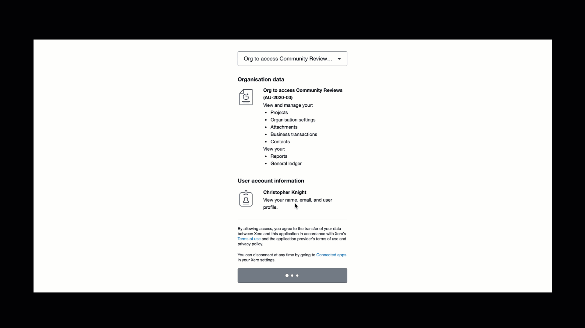

This is a basic application showing how to get started with the Xero's official [xero-ruby](https://github.com/XeroAPI/xero-ruby) SDK

*It uses [Sinatra](https://github.com/sinatra/sinatra) which is a DSL for creating simple web applications in Ruby with minimal effort*

# Getting Started
### 1) Make sure you have at least Ruby 2.7 [installed](https://www.ruby-lang.org/en/documentation/installation/)
```bash
ruby -v
ruby 2.7.0
```

### 2) Create an app in Xero's developer portal
https://developer.xero.com/myapps/

### 3) Decide what `scopes` your application needs
https://developer.xero.com/documentation/oauth2/scopes

### 4) Rename `sample.env` to `.env` and replace with the **4 required parameters**

### 5) Clone & run the app
```bash
$ git clone git@github.com:XeroAPI/xero-ruby-oauth2-starter.git
$ cd xero-ruby-oauth2-starter/
$ bundle install
$ bundle exec ruby xero_app.rb
```

> Visit `http://localhost:4567/` and start exploring the code in your editor of choice 🥳

----

## Sample getting started code
Setting up and connecting to the XeroAPI with the `xero-ruby` SDK is simple

```ruby
@@xero_client = XeroRuby::ApiClient.new(credentials: {
  client_id: ENV['CLIENT_ID'],
  client_secret: ENV['CLIENT_SECRET'],
  redirect_uri: 'http://localhost:4567/auth/callback',
  scopes: ENV['SCOPES']
})

get '/auth' do
  redirect to(@@xero_client.authorization_url)
end

get '/auth/callback' do
  @@xero_client.get_token_set_from_callback(params)
  tenant_id = @@xero_client.connections.last['tenantId']
  @invoices = @@xero_client.accounting_api.get_invoices(tenant_id).invoices
end
```

Checkout `xero_app.rb` for all the sample code you need to get started for your own app

## App functionality

